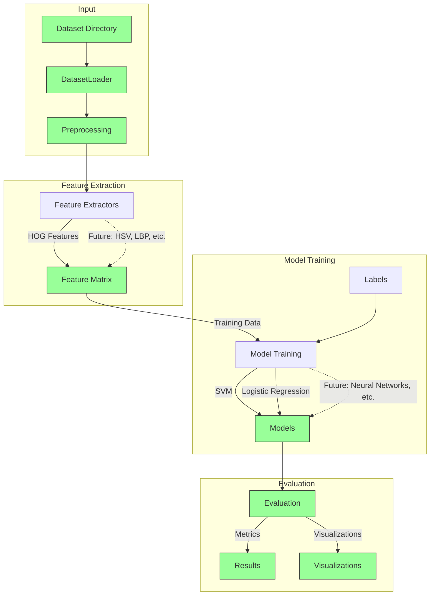

# Satellite Image Classification Framework

This framework provides a modular, extensible system for evaluating machine learning models on satellite image classification tasks. While initially designed for the [SPARK 2021](https://cvi2.uni.lu/spark-2021-dataset/) space object detection dataset, its architecture allows it to be adapted for any computer vision classification task.

Please see [RESULTS.md](./RESULTS.md) for a breakdown of our experimental results.

## Overview

The framework implements a complete machine learning pipeline that handles everything from data loading to model evaluation. It was designed with several key principles in mind:

1. Modularity: Each component (feature extraction, model training, evaluation) is independent and can be easily replaced or extended.
2. Reproducibility: All random operations are seeded, and all parameters are explicitly tracked.
3. Comprehensive Evaluation: Models are evaluated using multiple metrics including accuracy, precision, recall, F1 score, and ROC curves.
4. Easy Experimentation: Command-line interface makes it simple to try different models and parameters.



## Getting Started

### Installation

The project uses Poetry for dependency management. To get started:

```bash
# Clone the repository
git clone git@github.com:seansica/satellite-image-classifier.git
cd satellite-image-classifier

# Install dependencies
poetry install
```

### Basic Usage

The simplest way to run the classifier is:

```bash
poetry run python -m app.cli --data-path path/to/dataset
```

This will run the classification pipeline with default settings. For more control, you can specify additional parameters:

```bash
poetry run python -m app.cli \
    --data-path path/to/dataset \
    --feature-extractor hog \
    --models svm logistic \
    --train-ratio 1.0 \
    --test-ratio 1.0 \
    --image-size 224 224 \
    --log-level DEBUG
```

`train-ratio` and `test-ratio` allows you to specify how much of the training corpus to use. Use small values like 0.05 and 0.1 for testing/toy models. `train-ratio` controls the `train_rbg/` and `validate_rgb/` percentage while `test-ratio` only controls the `test_rgb/`.

### Output

The framework generates comprehensive evaluation results in the `results` output directory. Each experiment is organized into its own subdirectory that is timestamped and annotated with key identifying information such as model and train ratio:

```
results
├── 2024-12-08_15-02-23_LOGISTIC_ResNet50F__train1p00
│   ├── experiment_config.yaml
│   ├── metrics
│   │   └── LogisticRegression_metrics_summary.txt
│   ├── models
│   │   └── LogisticRegression
│   │       ├── architecture.yaml
│   │       └── model.pt
│   └── plots
│       ├── LogisticRegression_confusion_matrix.png
│       └── LogisticRegression_roc_curves.png
```

## Dataset Structure

The framework expects datasets to be organized in a directory structure where each subdirectory represents a class:

```
dataset/
├── test_rgb/
|   ├── image1.jpg
|   ├── image2.jpg
|   ├── ...
├── train_rgb/
│   ├── AcrimSat/
│       └── image1.jpg
|       ├── image2.jpg
|       ├── ...
│   ├── Aquarius/
│   ├── class3/
│   ├── class4/
│   ├── .../
└── validate_rgb
    ├── AcrimSat/
    ├── Aquarius/
    ├── class3/
    ├── class4/
    ├── .../
```

A file named `test_labels.csv` is expected in the root of the dataset directory:
```csv
id,image,depth,class,bbox
0,image_00000_img.png,image_00000_depth.png,1,"[457, 524, 684, 733]"
1,image_00001_img.png,image_00001_depth.png,6,"[58, 193, 299, 495]"
2,image_00002_img.png,image_00002_depth.png,0,"[411, 406, 491, 490]"
3,image_00003_img.png,image_00003_depth.png,7,"[346, 640, 763, 892]"
4,image_00004_img.png,image_00004_depth.png,9,"[436, 574, 734, 842]"
```

This file is essential because the test set is not annotated. We map the empirical indices in the `class` column to map back to the satellite class names shown in the subdirectories above (e.g., AcrimSat, Aquiarius, etc.).

While initially designed for the SPARK 2021 space object detection dataset, which includes classes like AcrimSat, Aquarius, Aura, etc., the framework can work with any image dataset organized in this manner.

## Features

- Multiple feature extraction methods
  - Histogram of Gradients (HOG)
  - Hue, Saturation, and Value (HSV)
  - Lineary Binary Patterns (LBP)
  - ResNet50 (activations extracted from the penultimate layer)
- Multiple classification models
  - Support Vector Machine (SVM)
  - Logistic Regression (LR)
  - Random Forest (RF)
  - Gradient Boosted Model (GBM)
- Automatic data splitting with stratification
- Comprehensive evaluation metrics
- Visualization of results including confusion matrices and ROC curves
- Detailed logging and error handling
- Easy extension points for new models and feature extractors

## Performance Considerations

When working with large datasets, consider:

1. The `train-ratio` and `test-ratio` parameters to limit memory usage
2. Image resolution settings via `image-size`
3. Feature extraction method choice, as some methods may be more computationally intensive

## Limitations

- Currently supports only image classification tasks
- Images must be in jpg format
- All images in a dataset must be accessible as files on disk

See [CONTRIBUTING.md](./CONTRIBUTING.md) for information on extending the framework with new models or feature extractors.